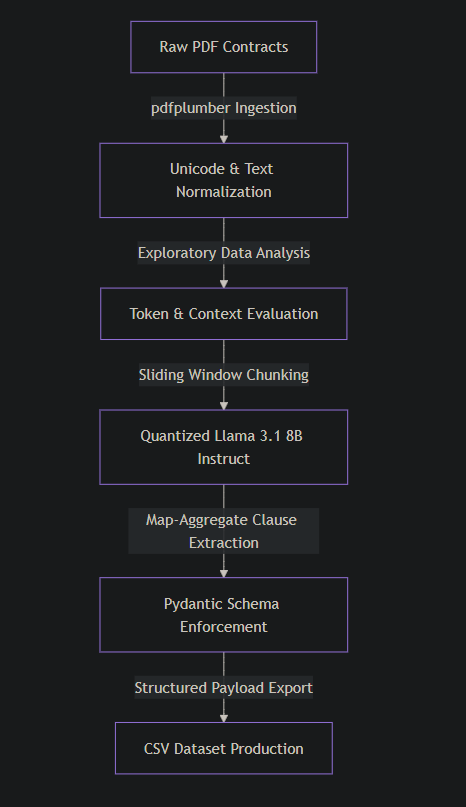

# Legal Contract Extraction Pipeline

This repository implements an automated Document AI pipeline designed to extract structured data and verbatim legal clauses from unstructured PDF contracts. 

## Architecture Overview
The pipeline is designed for local, privacy-compliant execution using open-source models, mitigating the need to send sensitive legal documents to third-party APIs.

1. **Ingestion:** Uses `pdfplumber` for layout-aware text extraction, stripping hyphens and standardizing whitespace.
2. **LLM Orchestration:** Runs `Meta-Llama-3.1-8B-Instruct` locally. To fit the model and a large context window into standard GPU VRAM (e.g., T4/P100), the model is quantized to 4-bit using `BitsAndBytes`.
3. **Structured Output:** Enforces strict JSON generation using system prompt engineering, validated against a Pydantic schema before exporting to CSV.

## Core Pipeline Architecture
